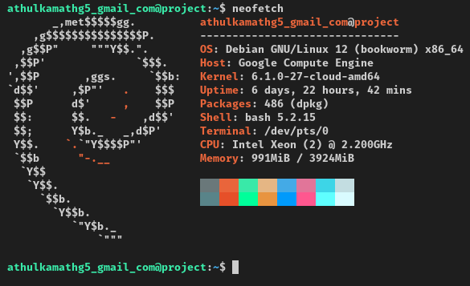

# Hosting the App 

## Tech Stack
* **Node.js** and any Linux distribution for local development.  
* **Clerk** for authentication.  
* We chose **Next.js** because that is what we were familiar with.  
* **Socket.io** was chosen as the WebSocket library.  
* **Tailwind CSS** was used for building the UI.  
* An outdated version of Next.js was chosen because, at the time of starting this project, Next.js had recently launched and did not yet support Vercel's own ShadCN UI library. As a result, we settled on Next.js version 14.2.  
* **Google Cloud** was chosen to host the app because Vercel does not support WebSocket connections.  
  

## Integrating Socket.io with Next.js
* We followed the Socket.io docs to integrate Next.js with it. You can check the documentation [here](https://socket.io/how-to/use-with-nextjs).  
* The Next.js app router was used in this project.  
* After following the instructions mentioned in the documentation, the app will run using the `server.js` file. The command to run the app is now:  
  ```bash
  node server.js  
  ```  
  This command must be executed from the root of the project.

## Hosting the App
* The app is hosted on a **Google Cloud VM instance (e2-medium)**. Anything less than an e2-medium is too slow to work with.  
* Google Cloud provides free credits worth ₹25,000 INR without requiring a credit or debit card. Other VPS/cloud providers we tried (e.g., Hetzner, Digital Ocean, etc.) required an international card with a transaction fee of about ₹1,000 INR (refundable).  
* If you do not receive free credits, sign up for the **GitHub Student Pack**. Usually, you will receive a welcome email within a week of registering, which provides free access to Digital Ocean. Alternatively, you can use the **e2-micro** instance, which is forever free on Google Cloud.  

  

## SSH Access to the VM
* We followed [this guide](https://medium.com/@jahandar.jahani/a-step-by-step-guide-to-connecting-vs-code-for-remote-debugging-python-code-in-google-cloud-vm-9960fb27c54f) on Medium to set up SSH access to our VM instance so that we could access it from our development machine’s VS Code.  
* First, install the **gcloud CLI** on your local machine. Then, go to the Google Cloud Console and allow ports [4040, 22, 443, 80], as well as HTTP and HTTPS traffic, when creating the instance. If needed, allow any other ports (e.g., 3000 for running the app).  

**Note:** UFW is not the firewall used in Google Cloud VMs.  

* After that, generate SSH keys on your local machine and follow the instructions in the Medium article.  
* Check the bash script in the `readme_files` directory of this project and also the `config` file if there are any issues setting up SSH access.  
* The machine can also be accessed via a browser window directly from the Google Cloud Console's SSH option.

## Authentication Method
* **Clerk** has been used to set up authentication. It supports various methods like Google, GitHub, email and password, etc., but in this project, we restricted it to just Google.  
* Set up a new project on the Clerk dashboard, follow the documentation, and install the Clerk SDK to your application.  
* Create a `.env.local` file in the root of the application and add it to `.gitignore` to keep your API keys secure.  
* Add these lines to your `.env.local` file after the API keys to set up the login route:  
  ```  
  NEXT_PUBLIC_CLERK_SIGN_IN_URL=/login  
  NEXT_PUBLIC_CLERK_SIGN_UP_URL=/login  
  ```  
  We used the same route for both the `sign_in` and `sign_up` URLs because this project uses only Google authentication.  

* Create a route for login like this:  
  ```  
  /src/app/login/[[...login]]/page.tsx  
  ```  
  This creates a dynamic route for the login URL.  
* To redirect all unauthenticated users to the login page, check the `middleware.ts` file in this project, which has been modified for this purpose.

## Setting Up the Project on the VM Instance
* Install Node.js from [Nodesource](https://deb.nodesource.com/), as the Debian repository might have an outdated version. The official Node.js documentation only mentions a user-level installation, but we need a global installation for this project.  
* Clone the repository to your user directory and create a `.env.local` file with your Clerk API keys.  
* Run the following commands on the VM terminal:  
  ```bash  
  cd project  
  npm install  
  sudo npm install -g pm2  
  npm run build  
  pm2 start server.js --name chat  
  pm2 save  
  pm2 startup  
  ```  
  **pm2** is used to run the project in the background so it does not require an open terminal.  

* Set up **Nginx** by running:  
  ```bash  
  sudo nano /etc/nginx/sites-available/default/nextjs  
  ```  
* Use this example configuration and paste it into the file opened by Nano:  
  ```nginx  
  server {  
      listen 80;  
      server_name VM_IP_OR_DOMAIN;  # Replace with your domain or IP address  

      location / {  
          proxy_pass http://localhost:3000;  # Points to your Next.js app running locally on port 3000  
          proxy_http_version 1.1;  
          proxy_set_header Upgrade $http_upgrade;  
          proxy_set_header Connection 'upgrade';  
          proxy_set_header Host $host;  
          proxy_cache_bypass $http_upgrade;  
      }  

      # Optionally, configure SSL if using HTTPS  
      # listen 443 ssl;  
      # ssl_certificate /path/to/cert.crt;  
      # ssl_certificate_key /path/to/cert.key;  
  }  
  ```  
* Check for any issues in the setup using:  
  ```bash  
  sudo nginx -t  
  ```  
* If there are no issues, restart Nginx:  
  ```bash  
  sudo systemctl restart nginx  
  ```  
* The project should now be accessible in any browser using the IP address or domain. Optionally, check if pm2 is running and view the logs using:  
  ```bash  
  pm2 logs chat  
  ```  

# That’s it! This should set up the project from start to finish.
